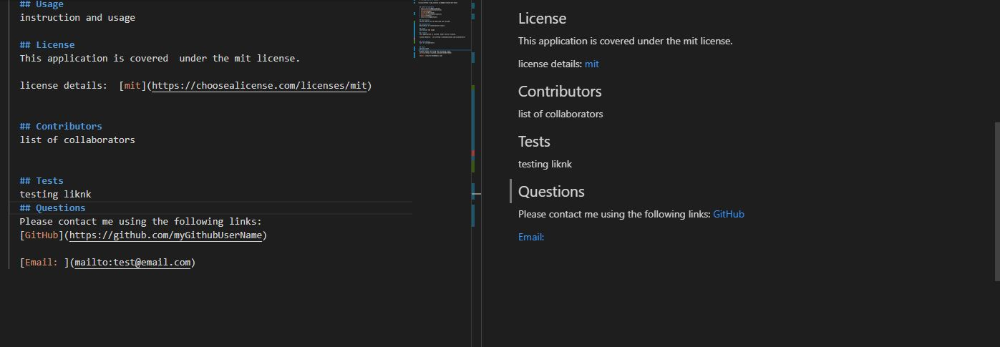

  # Unique-ReadmeGenerator
  

      
  
  ## Table-of-Contents
  * [Description](#description)
  * [Installation](#installation)
  * [Usage](#usage)
  * [License](#License)
  * [Contributing](#Contributors)
  * [Tests](#tests)
  * [Screenshots](#screenshots)
  * [Questions](#questions)
  
  ## Description
  The project facilitates  the process of readme file creation for any project
    The target of the project is simplification o

  ## Installation
  1. Clone the Repo 2. Install node.js 3.Install npm inquirer 4. Run node index.js

  ## Usage
  open terminal. run node index.js, compete creating readme file by answering prompt questions

  ## License
  This application is covered  under the mit license.
  
  license details:  [mit](https://choosealicense.com/licenses/mit)
    

  ## Contributors
  no collaborators

  ## Tests
  You can find  a testin/tutorial video  using following link: [Video](https://youtu.be/bfHiim-EzpM)
  ## Screenshots  
  

  
  ## Questions
  Please contact me using the following links:

  [GitHub: Feliks](https://github.com/felixbor)

  [Email: Me ](mailto:felixbor@gmail.com)
  
